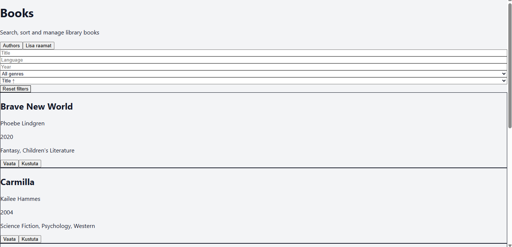
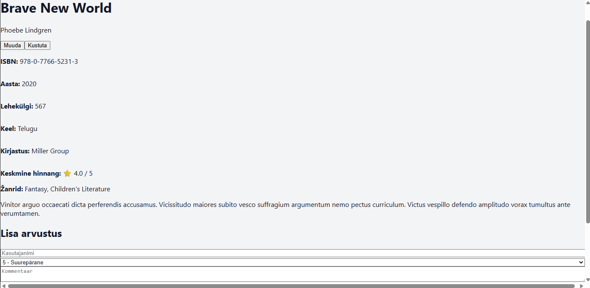
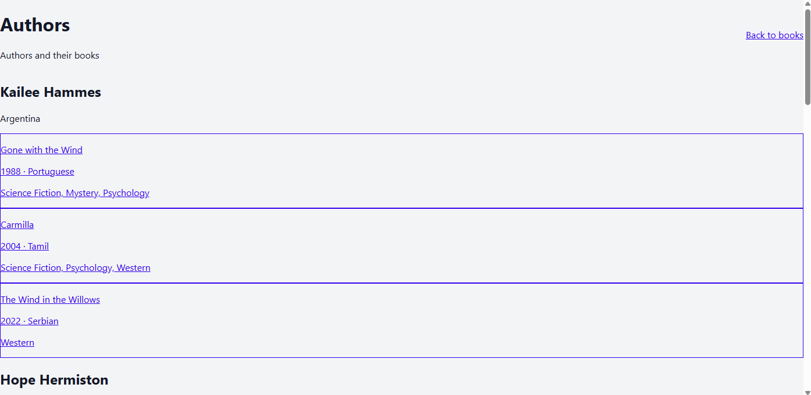

# React Frontend — Raamatukogu Infosüsteem

Frontend-rakendus raamatukogu REST API süsteemile, mis on loodud Reacti, TypeScripti ja Vite abil.

---

# Autorid ja ülesannete jaotus

## Kristina Jersova

Teostatud funktsionaalsus:

- Raamatute nimekirja leht
- Raamatu detailvaade
- Raamatu lisamine / muutmine / kustutamine
- Arvustuste süsteem
- Lehekülgede navigeerimine (pagination)
- Sorteerimine ja filtreerimine
- Autorite leht
- Žanri filter
- Tailwind CSS kasutajaliides
- Backend API ühendamine frontendiga

---

# Tehnoloogiad

- React
- TypeScript
- Vite
- Axios
- React Router v6
- Tailwind CSS

---

# Backend repositoorium

Backend repositooriumi link:

https://github.com/YOUR_BACKEND_REPOSITORY_LINK

---

# Paigaldamine

## 1. Klooni repositoorium

git clone YOUR_FRONTEND_REPOSITORY_LINK

2. Ava projekt
cd frontend

3. Paigalda sõltuvused
npm install

# Keskkonnamuutujad

Loo projekti juurkausta .env fail:

VITE_API_URL=http://localhost:3000/api/v1

# Rakenduse käivitamine
## Arendusrežiim
npm run dev

### Rakendus töötab aadressil:

http://localhost:5173

## Production build
npm run build

# Kohustuslikud funktsioonid
- Raamatute nimekiri
- Raamatu detailvaade
- Raamatu lisamine
- Raamatu muutmine
- Raamatu kustutamine
- Arvustused
- Keskmine hinnang
- Pagination
- Sorteerimine
- Filtreerimine
## Boonusfunktsioonid
- Autorite leht
- Žanri dropdown filter
- Arvustuse kustutamine

# Ekraanipildid
- Raamatute leht

- Raamatu detailvaade

- Autorite leht

# Projekti struktuur
src/
- ├── api/
- ├── components/
- ├── pages/
- ├── App.tsx
- └── main.tsx

# Märkused
- Backend server peab töötama enne frontendi käivitamist
- API aadress määratakse .env failis
- Kõik API päringud kasutavad Axios't
- TypeScript tüüpe kasutatakse kogu projektis